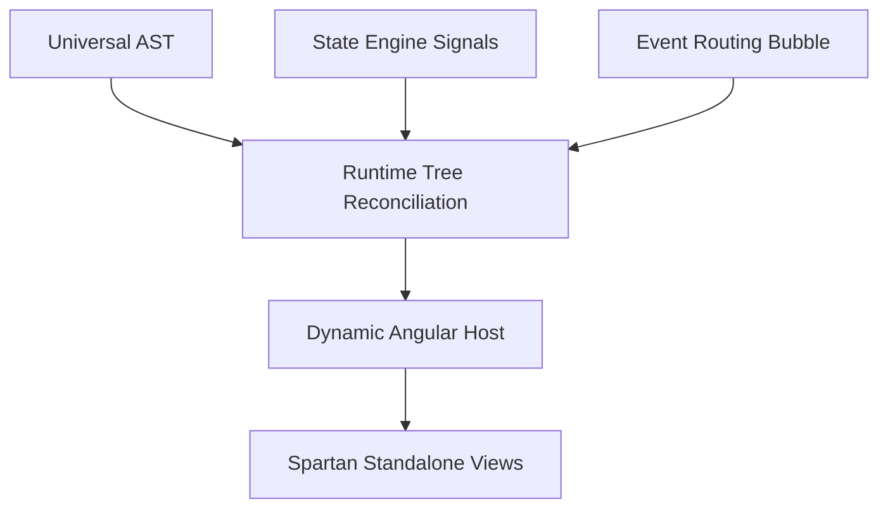

# GUIP Architecture Design

This document details the design specifications, reactive model, and pipeline layers for the Generative UI Protocol (GUIP) reference runtime.



---

## 1. Runtime Core Layer

The `runtime-core` is a framework-independent module written in pure, strict TypeScript. It is completely isolated from browser DOM structures or view components.

Its responsibilities include:
1. **Normalization**: Traverses incoming raw AST structures, assigns stable UUID-like node identifiers if missing, and initializes default empty properties mapping.
2. **Reconciliation**: Employs a recursive tree-matching reconciliation algorithm.
3. **Patch Generation**: Computes fine-grained differences between the current tree state and the target tree structure, outputting serializable `ASTPatch` operations (`add`, `remove`, `replace`).
4. **Patch Application**: Applies patches incrementally to the runtime model, enabling high-performance streaming updates without destroying client states.

---

## 2. Signal-Based State Engine

The state engine provides a framework-independent reactive store. It is inspired by Angular and Solid signals.

Key constructs:
- **`createSignal(val)`**: The primitive cell of reactivity. Tracks reactive subscribers (effects/computeds) automatically during reads (`get`) and schedules notifications on writes (`set`).
- **`computed(fn)`**: A read-only reactive cell containing a formula. Lazily caches values and automatically updates when dependency signals trigger.
- **`effect(fn)`**: Executes side-effects in response to dependency changes. Includes cleanup callback mechanics.
- **`store(obj)`**: Proxies nested objects deeply, converting structural property reads and writes into reactive signal bindings automatically.

---

## 3. Bubbling Event Engine

Interactive elements in GUIP dispatch serializable UI events through the event router.

```typescript
type UIEvent = {
  type: string;
  target: string;
  timestamp: string;
  payload?: Record<string, any>;
  bubbles?: boolean;
}
```

The router propagates events through the resolved tree hierarchy:
1. **Capture Phase**: Propagates down from root node to target node.
2. **Bubble Phase**: Ascends from target node back to root.
3. **Global Listener Hooks**: Dispatches events to connected MCP sidecars, streaming sockets, and external Python agent streams, allowing AI agents to dynamically execute actions in response to user actions (e.g. click triggers form regeneration).
